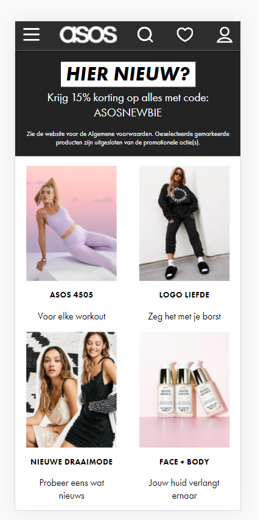
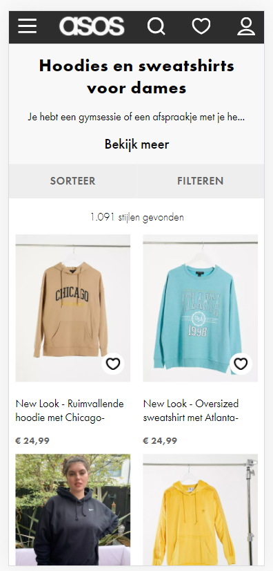
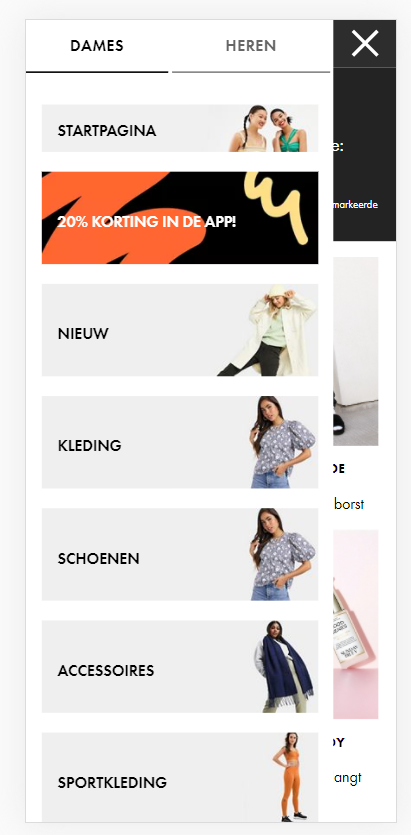
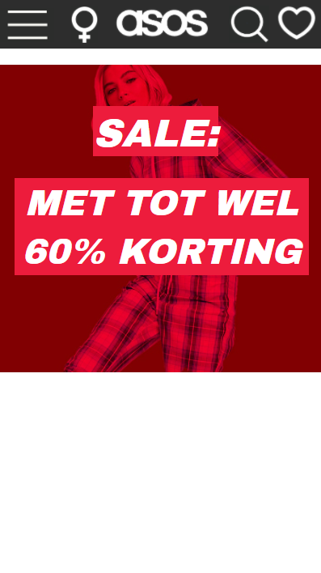
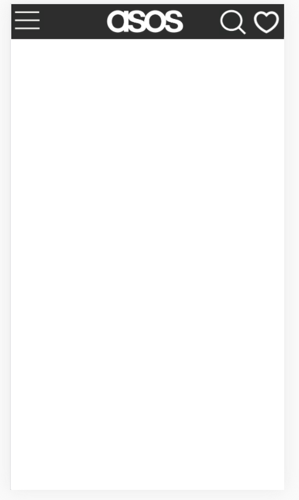
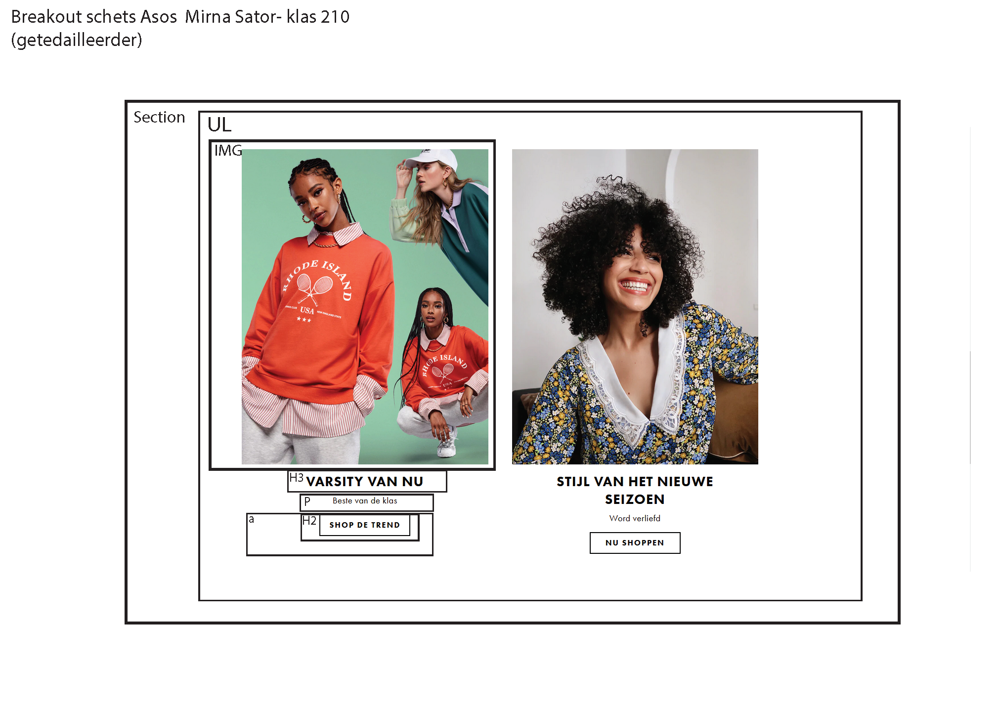

# Procesverslag
**Auteur:** -Mirna Sator-

Markdown cheat cheet: [Hulp bij het schrijven van Markdown](https://github.com/adam-p/markdown-here/wiki/Markdown-Cheatsheet). Nb. de standaardstructuur en de spartaanse opmaak zijn helemaal prima. Het gaat om de inhoud van je procesverslag. Besteedt de tijd voor pracht en praal aan je website.

## Bronnenlijst
1. -https://www.asos.com/nl/dames/-

## Eindgesprek (week 7/8)

-Aangezien ik het moeilijk vind om te coderen en al moeite had om in te komen met dit nieuwe schooljaar, heb ik minder gedaan in de weken voor de vakantie voor FED dan ik had gewilt, maar in de vakantie heb ik goed mijn tijd genomen en heb ik me gelukkig weer kunnen herpakken. Ik vond het een leuke opdracht om te doen, ik heb er weel veel moeite voor gedaan omdat ik het een lastiger vak vind, maar toen ik de app uiteindelijk af had vond ik het achteraf gezien toch heel vet om te doen.-

**Screenshot(s):**
  

-screenshot(s) van je eindresultaat-

## Voortgang 3 (week 6)

-same as voortgang 1-

**Screenshot(s):**

### Agenda voor meeting
| Mirna                      | Rikkert                   | Bas                          | Sophie                                           |
| -------------              |:-------------:            | -----:                       | -----:                                           |
| sematisch checken CSS en HTML| Grid grootte            |   sematisch checken HTML     | Is display:none; correcte code?                  |
|                            |Grid juist plaatsen         |                              | Errors uit javascript halen                      |
|                            | img grootte in grid        |                              | Hoe krijg je gradient over een element?          |
|                            |                           |                              | Hoe zorg ik ervoor dat ie bovenaan blijft staan als hij uitklapt? VANAF REGEL 129 JS/ 125 HTML

### Verslag van meeting
We zijn het lijstje van links naar rechts af gegaan. Dus begonnen bij feedback voor Mirna en geindigd bij Sophie. Bij mirna hebben we naar de HTML en CSS gekeken ofdat dit wel semantisch correct was. Dit was het geval. Voor de CSS is er aangegeven dat er op een container een display flex kan worden gezet i.p.v. de children elementen een diplay absolute te geven. Hierna had Rikkerteen vraag over grid. Hij had een afbeelding en een stuk tekst naast elkaar staan en dit in 2 kolommen staan en als het scherm kleiner wordt dan moesten deze onder elkaar komen. Dit kon worden opgelost door de grid columns op 1 volledige koloms breedte te zetten. Hierna kwam ik aan de beurt. Ik had de vraag of mijn HTML wel sematisch correct zou zijn. Dit was niet helemaal het geval. Ik had te veel divjes gebruikt en te veel sections. De sections konden worden vervangen voor articles. Als laatste kwam Sophie en zij had een aantal vragen. De vraag over de errors in haar JavaScript dat was te verwaarlozen. Hierna was er een vraag over hoe zij een gradient zou kunnen toevoegen over een element heen. Dit zou kunnen worden opgelost door middel van een after neer te zetten op de section. Hierna hebben we nog het vak FED geevalueerd met de student assistenten en gepraat over het volgende blok.

## Voortgang 2 (week 5)

-Het is nu wat rustiger qua deadlines, dus heb ik meer tijd gehad om eraan te werken.-

**Screenshot(s):**

### Agenda voor meeting

| Mirna                      | Rikkert                   | Bas                          | Sophie |
| -------------              |:-------------:            | -----:                       | -----:                                 |
|  correcte code checken     | flex-box dingetje         |  Is de tweede pagina genoeg? | Wanneer wel/niet div'jes  |
|  flex-box dingetje         |   Tweede pagina meer info |                              | moeten de img op knopjes met background-image|
| Hoe krijgen we pluspunten? |                           |                              | Hoever moet filters toegepast worden? |

### Verslag van meeting
We zijn begonnen met naar de code te kijken van Mirna. Hier hebben we de CSS code opgeschoont samen met het team en met Sanne. Hij was erg tevreden over dat Mirna de selector "nth-of-type" vaak had gebruikt. Hierna zijn we verder gegaan met Rikkert om naar zijn Supreme website te kijken. Hier hebben we de carroussel op de homepage veranderd. Deze moet namelijk op het einde beginnen en op de page load naar links scrollen.
Sanne gaf als tip om bij de CSS iets uit te commenten als je gaat testen.
Als 3e kwam Sophie aan het woord. Hier hebben we besproken of we nou wel of geen divjes mogen gebruiken. Tevens hebben we naar haar code gekeken en deze een beetje aangepast. We hebben naar de horizontale scrollable section gekeken en van divjes hebben we een ul en li gemaakt. Sanne heeft verteld dat je een aria-label aan een button moet toevoegen voor screen readers.
Als laatste heeft Bas zijn website laten zien. Hij vroeg zich af of zijn 2e pagina goed genoeg was. Dit was niet het geval en mag een meer complexere pagina kiezen om dit uit te werken. Sanne heeft gevraagd of de website ook goed werkte met alleen een keyboard en liet Bas d.m.v. de tab toets navigeren door zijn website heen.

## Voortgang 1 (week 3)

### Stand van zaken

-Het opstellen van de html pagina ging goed, maar door vele deadlines heb ik mijn tijd niet goed kunnen verdelen en loop ik een beetje achter.-

**Screenshot(s):**

### Agenda voor meeting

-1. semantisch correctheid (15 min) (uitleg)
-2. Javascript             (30 min) (opdrachten bekijken)
-3. Css uitlijnen          (15 min) (uitleg)-

### Verslag van meeting

-Samen met de student assistenten hebben we gekeken naar onze code en of deze sematisch correct was. Ze hebben ons geholpen en uitleg gegeven over media queries.

Hierna hebben we de opdrachten van FED met de javascript opdrachten samen bekeken.
Hier hebben zij samen met ons de opdracht met de shoppingcart uitgelegd.
Tevens hebben zij ons een tip gegeven dat we eerst psuedo code moeten schrijven in het nederlands en deze moeten omzetten naar javascript.

Je mag wel div's gebruiken maar gebruik ze niet voor elementen waar al een HTML5 element voor is. Als je bij je eindgesprek kan uitleggen waarom je een div hebt gebruik (bijvoorbeeld om2 elementen een display flex te geven) dan is dat ook goed.

We hebben met z'n alle naar de code van 1 van de teamleden bekeken. Dit was omdat diegene ergens niet uit kwam. 1 van de student assistenten heeft toen laten zien hoe je d.m.v. met firefox kan debuggen. Dit doe je namelijk door de css als het ware "uit te vinken" in de editor.

tip: voeg leuke of grappige animaties toe met css (als je je avontuurlijk voelt ook JavaScript) om de docenten te verrassen.-

## Intake (week 1)

**Je startniveau:** -blauw-

**Je focus:** -surface-

**Je opdracht:** -https://www.asos.com/nl/dames/-

**Screenshot(s):**

![screenshot(s) die een goed beeld geven van de website die je gaat maken]

**Breakdown-schets(en):**

 
